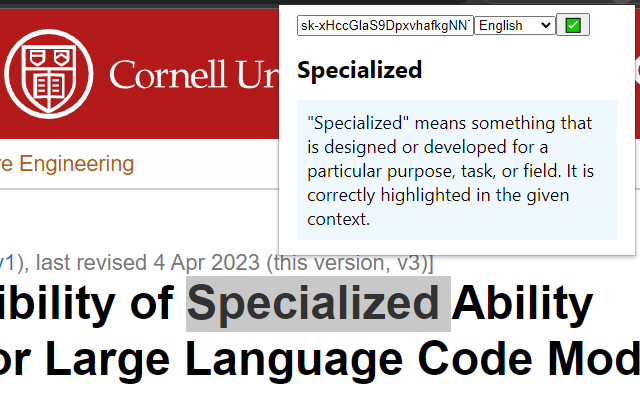

# simple-explainer

Simple explainer for language learners to understand words or phrases.



## Project setup
```
npm install
```

### Compiles and minifies for production
```
npm run build
```

### Compiles and minifies for development
```
npm run build-watch
```

Then the folder `/dist` contains the extension.

## Acknowledge
The template of this project was created via
```
vue create simple-explainer
cd simple-explainer
vue add chrome-extension-cli
```

Project icon was made via MidJourney
